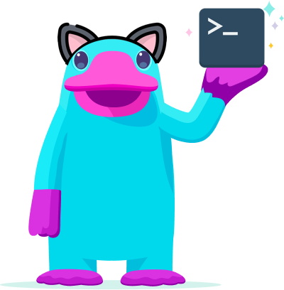

# Purrl

[](https://pkg.go.dev/github.com/pulumiverse/pulumi-purrl/sdk)



This provider is designed to be a flexible extension of your Pulumi code to make API calls to your target endpoint. `Purrl` is useful when a provider does not have a resource or data source that you require, so `Purrl` can be used to make substitute API calls.

## Installing

This package is available for several languages/platforms:

### Node.js (JavaScript/TypeScript)

To use from JavaScript or TypeScript in Node.js, install using either `npm`:

```bash
npm install @pulumiverse/purrl
```

or `yarn`:

```bash
yarn add @pulumiverse/purrl
```

### Python

To use from Python, install using `pip`:
``
```bash
pip install pulumiverse-purrl
```

### Go

To use from Go, use `go get` to grab the latest version of the library:

```bash
go get github.com/pulumiverse/pulumi-purrl/sdk
```

### .NET

To use from .NET, install using `dotnet add package`:

```bash
dotnet add package Pulumiverse.Purrl
```

## Reference

For detailed reference documentation, please visit [the Pulumi registry](https://www.pulumi.com/registry/packages/purrl/api-docs/).
